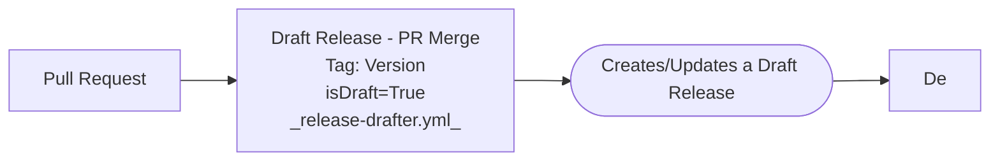
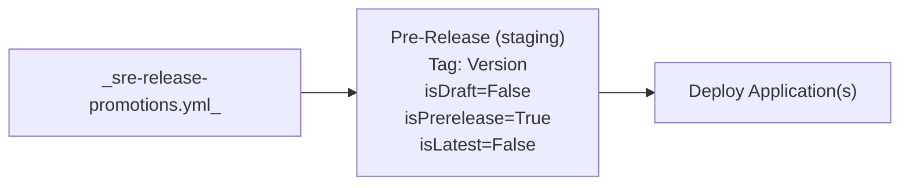
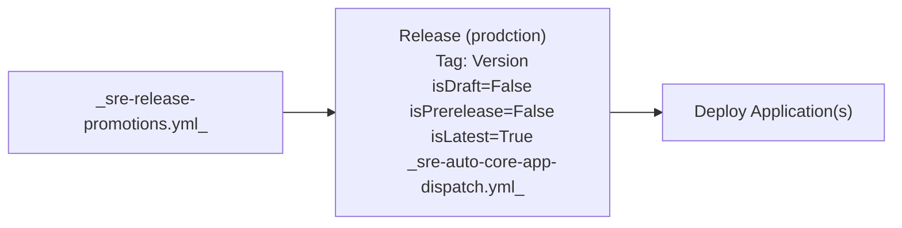

# Manscaped 5 Server Workflows Readme

### Git Flow

#### Build/Deploy



#### Release to Staging (Pre-Release)



#### Release to Production (Release)



### Release SHA Python Document

Here are the commands to get the SHAs for the respective release(s)?

```bash
### If you are running this from your local maching for the github repo - 
# To get the current draft release commit hash (sha)
python .github/workflows/python/release_sha.py --draft

# To get the current prerelease commit hash (sha)
python .github/workflows/python/release_sha.py --prerelease

# To get the current release (latest-published) commit hash (sha)
python .github/workflows/python/release_sha.py --release

# To run the script with Icecream enabled
python .github/workflows/python/release_sha.py --debug
```
