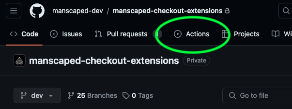
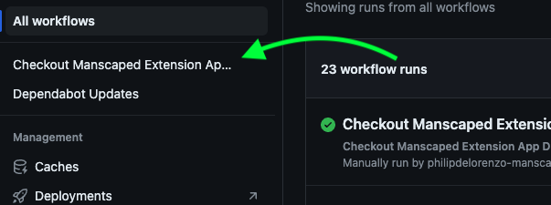
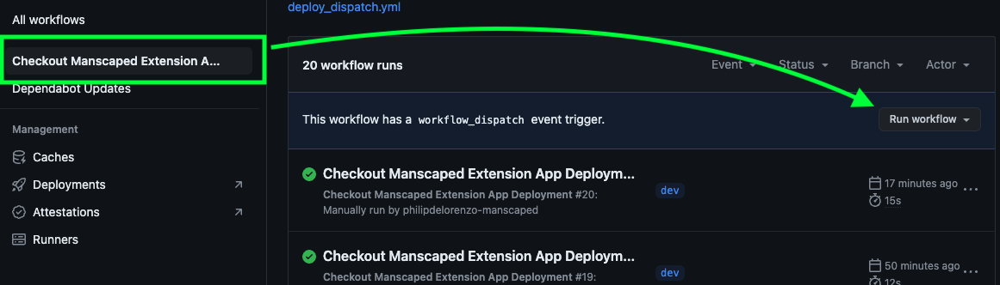
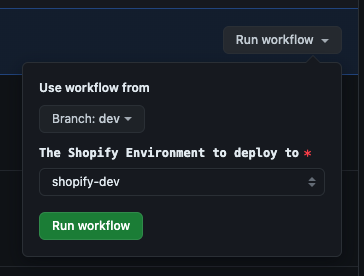

# Deployment Process

This document describes the deployment process for the project.

## Deployment

The deployment process is automated using GitHub Actions. The deployment process is triggered manually in the GitHub Actions tab in the repository.

The deployment process includes the following steps:

1. Navigate to the GitHub Actions tab in the repository.
   
2. Click on the workflow you want to run -- for example, `Checkout Manscaped Extension App Deployment`.
   
3. Click on the `Run workflow` button.
   
4. Select the branch you want to deploy.
5. Select the environment you want to deploy to.
6. Click the green `Run workflow` button.

**NOTE:** Currently, the only environment to deploy to is the Development in Shopify.
Please see your leadership if deployment is required in upper environments.
